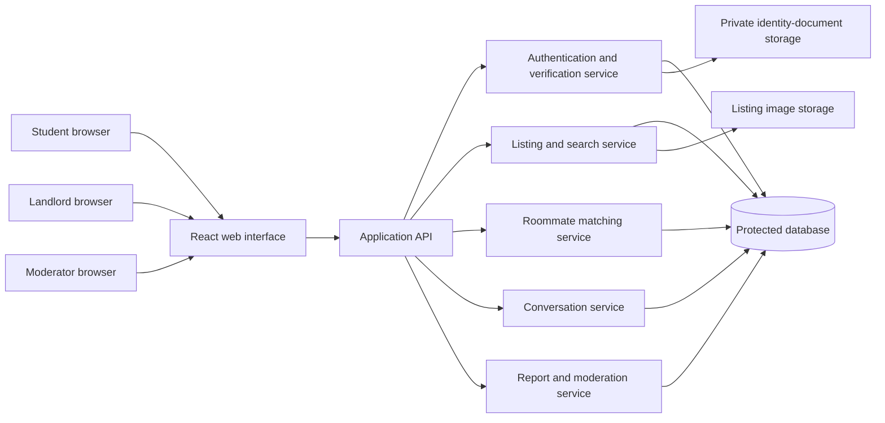

# Proposed Backend Logic and Functionality

## Purpose

This document explains how BashaMate could evolve beyond the current frontend prototype. It is an architecture and logic proposal only. The running project does **not** expose these services, retain user records, or enforce the rules below.

## Proposed System Overview

## Suggested Domain Model

| Entity | Key fields | Notes |
| --- | --- | --- |
| User | id, role, name, phone status, university, profile status | A user has one role or a carefully defined multi-role policy. |
| StudentProfile | user id, budget range, areas, habits, move-in date, verification level | Public and private fields must be separated. |
| Listing | id, landlord id, title, area, rent, tenant fit, availability, moderation status | Search returns only visible approved listings. |
| ListingImage | id, listing id, storage key, review status | Image bytes should live in object storage, not directly in the database. |
| Favorite | student id, listing id, created at | Enforce one saved record per student and listing. |
| RoommatePreference | student id, budget, areas, routine, lifestyle choices | Inputs for matching; handle consent explicitly. |
| Match | id, student A, student B, score snapshot, accepted states | A score creates a suggestion, not an automatic conversation. |
| Conversation | id, participant ids, source match or listing inquiry | Created only after allowed actions. |
| Message | id, conversation id, sender id, body, sent at | Validate participants and rate-limit sending. |
| Report | reporter id, target type, target id, reason, status | Store moderation decision and reviewer history. |

## Core Backend Workflows

### 1. Verification workflow

The browser submits a phone number. The server sends a short-lived OTP through an approved provider, records a hashed or protected confirmation attempt, and marks the phone as confirmed only after a correct code. A student can then upload a university ID to private storage; a reviewer or controlled validation process updates the verification level. Public listing pages must never reveal ID documents, personal phone numbers, or guardian contacts.

### 2. Listing search workflow

The API validates filter parameters such as area, maximum rent, tenant fit, and pagination. It queries only listings whose moderation status permits public display. The search response contains safe public fields: title, approximate area, rent, amenities, images, tenant fit, and host trust indicator. Private address details and sensitive host records are retrieved only when policy permits.

### 3. Roommate matching logic

A transparent starting formula can rank a candidate using weighted components. For example:

| Component | Example consideration | Role in score |
| --- | --- | --- |
| Area overlap | Same preferred area or nearby area | Strong positive signal |
| Budget overlap | Intersecting acceptable monthly ranges | Strong positive signal |
| Routine compatibility | Compatible sleep and study patterns | Medium positive signal |
| Shared-space preferences | Cleaning, cooking, guest, and smoking preferences | Medium positive signal |
| Availability | Move-in timing overlaps | Moderate filter or bonus |

The system should show a human-readable explanation, provide an opt-out, and require mutual consent before opening a conversation. It should not make sensitive inferences or promise relationship outcomes from a score.

### 4. Messaging workflow

An inquiry creates a conversation only if the recipient accepts the request or if product policy allows a controlled first message. The API checks that the sender belongs to the conversation before returning or creating messages. Real-time delivery could use WebSocket or server-sent events; a durable database stores message history. Rate limits, content reporting, and block controls are required before release.

### 5. Moderation workflow

Users submit a report containing target, category, and optional detail. The platform aggregates reports but should not rely solely on a numerical threshold for irreversible enforcement. High-risk or repeated reports may temporarily hide content pending review. A moderator decision records reviewer identity, reason, timestamp, action, and restoration path. The system must restrict the moderator interface with role-based authorization.

## Security and Privacy Controls

| Risk area | Proposed control |
| --- | --- |
| Passwords | Use an established authentication provider or a strong password-hashing algorithm such as bcrypt or Argon2. |
| Phone numbers and guardian contact | Encrypt or protect at rest; reveal only according to explicit role and consent rules. |
| Student ID images | Store privately with short-lived signed access URLs; never expose directly in public API responses. |
| API access | Validate input, authenticate every request, authorize every resource access, and rate-limit abuse-prone routes. |
| Listings and reports | Keep audit records and validate content before public visibility. |
| Browser security | Use HTTPS, secure cookies or token practices, content security policy, and output escaping. |

## Example API Responsibilities

| Endpoint family | Responsibility |
| --- | --- |
| `/auth/*` | Registration, login, OTP confirmation, logout, session state |
| `/listings/*` | Search, create, update, publish, fetch listing details |
| `/favorites/*` | Add, remove, list saved homes for the authenticated student |
| `/roommates/*` | Store preferences, return consent-safe match suggestions, send requests |
| `/conversations/*` | Create allowed conversations, list messages, send a message |
| `/reports/*` | Submit report, view personal report state, moderator review actions |
| `/admin/*` | Role-protected moderation and audit functions |

## Separation From the Current Prototype

The current React project mimics the user experience only. Local state is used for filters, saved homes, messages, connection requests, form validation, and report statuses. Any future backend must replace those local state transitions with authenticated API calls, loading states, error states, access rules, persistence, and security controls.

